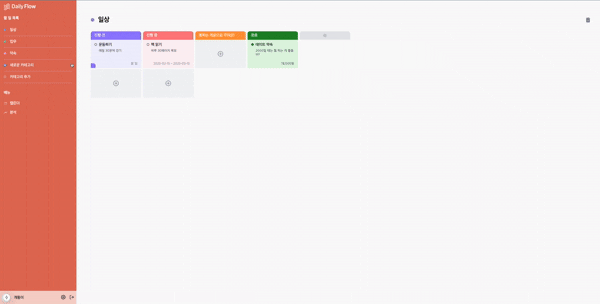
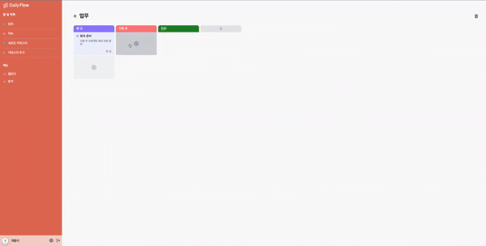
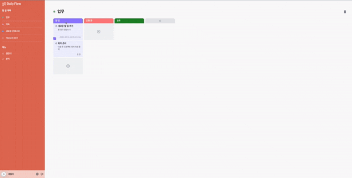
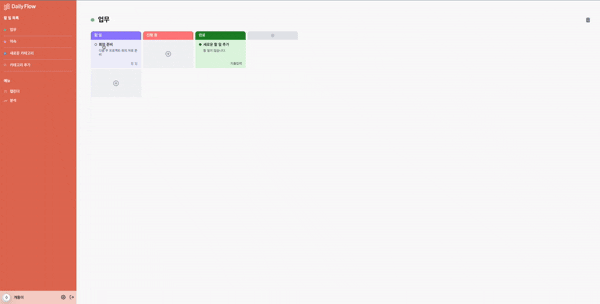
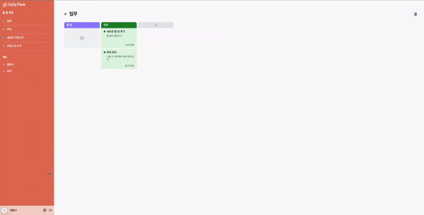
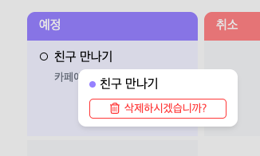
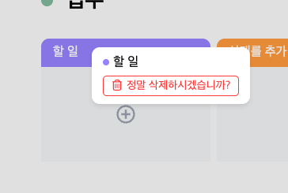

 

# 할 일 및 지출 흐름 관리 서비스, Daily Flow

## 프로젝트 소개

안녕하세요. 칸반보드 기반의 태스크 및 지출 관리 서비스 **Daily-Flow** 입니다.

**Daily Flow**는 **소비가 일상 생활과 밀접하게 연결되어있다는 인사이트를 바탕으로 할 일과 지출을 통합적으로 관리하고 분석할 수 있는 서비스**입니다. 사용자는 직관적인 칸반보드로 태스크를 관리하고 태스크를 완료하면 지출을 기록합니다. 이를 통해 일상 활동과 소비 패턴 간의 연관성을 파악하고 더 효율적인 재정 관리를 가능하게 합니다.

### 주요 특징

- 칸반보드 형태의 직관적인 태스크 관리
- 태스크와 지출 사이의 유기적 연결
- 지출 패턴 시각화 및 분석 기능(추가 예정)
- 태스크 기반으로 캘린더 제공(추가 예정)

## 주요 기능

### 1. 손쉬운 카테고리 생성

> 사용자는 필요한 만큼 카테고리를 생성하고 해당 카테고리 별로 지출 분석이 가능합니다.

#### 카테고리 생성

 

#### 카테고리 제거

 

### 2. 디테일한 태스크 추가

> 메인이 되는 할 일 속에도 수많은 태스크가 있습니다.
> 서브 태스크도 추가할 수 있으며 할 일과 일정을 구분해 캘린더에 표시합니다.

 

### 3. 간결한 태스크 디테일

> 최대한 정보를 간결하게 보여줄 수 있는 디자인을 지향합니다.
> 서브태스크 역시 단순 나열이 아닌 완료 여부를 표시할 수 있습니다.
> 칸반보드의 태스크 목록에서든 디테일에서든 손쉽게 완료처리가 가능합니다.

 

### 4. 지출 입력

> 완료된 테스크는 지출을 입력할 수 있습니다.
> 이를 기반으로 통계를 내 지출흐름 분석에 활용하게 됩니다.

 

### 5. 상태 추가

> 칸반보드 기반의 꽃은 다양한 상태들입니다.
> 상태를 쉽게 추가할 수 있으며 20가지의 컬러칩이 제공됩니다.

 

### 6. 그 외

> 추후 분석 및 캘린더 기능이 추가될 예정이며, 우클릭 팝업을 통한 삭제와 각종 키보드 이벤트를 활용한 직관적 사용을 제공합니다.

 
 

---

## 기술 스택

### 프론트엔드

- React/Next.js(App Router)
- Typescript
- Vanilla Extract

### 백엔드

- Nest.js

### 기타 도구

- Monorepo(Turborepo)
- PostgreSQL
- TypeORM
